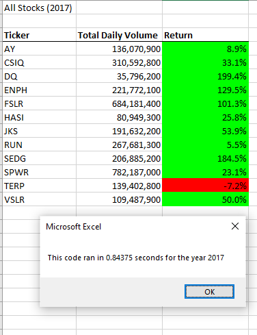
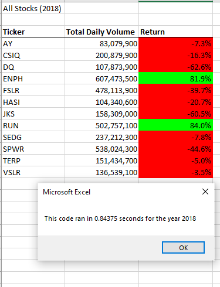
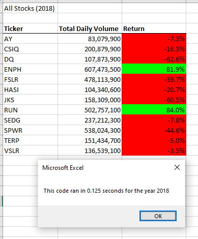

# Stock Analysis Reports for Steve
## Project Overview: Purpose of this analysis
This project creates a report to analyze "green" stocks performance in 2017 and 2018.  The report is for Steve to advise his parents on investing in worthy "green" stocks.  The report was created with Excel, Visual Basic Application (VBA) and macros.  The initial report focused on stock DQ, a stock his parents were interested in. The final report analyzes an additional 11 "green" stock in terms of volume, starting price and ending price to calculate return as a positive or negative investment.  For clarity, positive returns are highlighted in green, while negative returns are highlighted in red.
## Results
The first report produced results, but seemed to have room for improvement in terms of more elegant programming,
less lines of  codes and more efficient run times.  Although it executed and produced accurate report results, by refactoring the code, run times were reduced signficantly, whilst producing the same accurate results.
Refactoring included creation of arrays to reduce nested loop execution times.   For example, the inital code used two nested loops, going through the entire data sheet for each stock.  The second report used arrays, allowing the code to set up the tickers as an array and then loop through the data one time setting up the volume and % return for each stock.  The resulting code in the 2nd report ran over 6 times faster.

  
## Examples from the reports
# Images showing table and runtime
### VBA_Challenge 2017 before refactoring

### VBA_Challenge 2018 before refactoring 

### VBA_Challenge 2017 after refactoring - note much faster code execution time

### VBA_Challenge 2018 after refactoring - note much faster code execution time

## Summary
### Advantages and Disadvantages of refactoring code
The advantage of refactoring code is to produce better, working code, designed to do what it needs to do without extra complexity.  The disadvantage is that when refactoring, new problems can be introduced resulting in a lot of time required to fix the new problems and retest to get the code back to working.
### Advantages and Disadvantages of the original and refactored Green Stocks VBA Script
Refactoring of this code involved using less nesting levels (do loops), reducing complexity in the conditional statements and reducing the code line count.  There were advantages and disadvantages to this strategy.
#### Advantages:
*  Reuse of much of the code written for the stock_analysis project in terms of the logic for determining how to track the volume, starting price and ending price for each ticker. 
* Reuse of code to make the report available for multiple years with a macro button so Steve could run the report for either year 2017 or 2018.
#### Disadvantages
* By altering existing code, it's pretty easy to break what was working if you don't pay attention to every detail and keep a copy of the working code available to compare and contrast changes.
* When the code breaks, there is a lot of retesting required.

### How do these pros and cons apply to refactoring the original VBA script.
#### Pros: 
More efficient reporting times, less code to maintain.  Efficient run times will be even more important when dealing with very large data sets, especially during coding, if a mistake is introduced and the code has to be run multiple times to find the bug.
#### Cons:
By setting up the tickers in an array to get rid of the nested loops, it was very easy to mix up the variables and introduce mistakes.  Additionally, by refactoring the code, even though there was less code, it was a little more complicated to follow how each variable was assigned with names like tickers(tickerIndex).  I used the debug facilities to trace the variable assignments when the first reports of the refactored code volumes did not initially match the volumes of the first report.  Lots and lots of retesting and patience was required.

