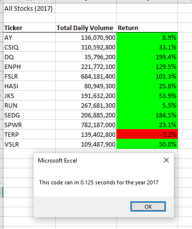

# Stock Analysis Reports for Steve
### *Stock-analysis module 2 assignment*
## Project Overview: Purpose of this analysis
This project creates a report to analyze green stocks performance in 2017 and 2018.  The report is for Steve to advise his parents on investing in worthy "green" stocks.  The report was created with Excel, Visual Basic Application (VBA) and macros.  The initial report focused on stock DQ, a stock his parents were interested in. The final report analyzes an additional 11 "green" stock in terms of volume, starting price and ending price.
## Results
The first report produced results, but seemed to have room for improvement in terms of more elegant programming,
less lines of  codes and more efficient run times.  Although it executed and produced accurate report results, by refactoring the code, run times were reduced signficantly, whilst producing the same accurate results.
Refactoring included creation of arrays to reduce nested loop execution times.   For example, a snippet of the inital code with nested loops looked like this:
`For i = 0 To 11
       ticker = tickers(i)
       totalVolume = 0
       '5) loop through rows in the data
       'Worksheets(yearValue).Activate
       For j = 2 To RowCount
           '5a) Get total volume for current ticker

           If ActiveSheet.Cells(j, 1).Value = ticker Then
               'test = ActiveSheet.Cells(j, 8).Value
               totalVolume = totalVolume + ActiveSheet.Cells(j, 8).Value

           End If
           Worksheets(yearValue).Activate
           '5b) get starting price for current ticker
           If ActiveSheet.Cells(j - 1, 1).Value <> ticker And ActiveSheet.Cells(j, 1).Value = ticker Then

               startingPrice = ActiveSheet.Cells(j, 6).Value

           End If

           '5c) get ending price for current ticker
           If ActiveSheet.Cells(j + 1, 1).Value <> ticker And ActiveSheet.Cells(j, 1).Value = ticker Then

               endingPrice = ActiveSheet.Cells(j, 6).Value

           End If
       Next j
       '6) Output data for current ticker
       Worksheets("All Stocks Analysis").Activate
       ActiveSheet.Cells(4 + i, 1).Value = ticker
       ActiveSheet.Cells(4 + i, 2).Value = totalVolume
       ActiveSheet.Cells(4 + i, 3).Value = endingPrice / startingPrice - 1

   Next i
* Examples from the reports
## Images showing table and runtime
### VBA_Challenge 2017 before refactoring

### VBA_CHallenge 2018 before refactoring

### VBA_Challenge 2017 after refactoring

### VBA_CHallenge 2018 after refactoring 

## Summary
### Advantages and Disadvantages of refactoring code
My approach to refactoring this code was to go after less nesting levels (do loops), reduce complexity in the conditional statements and reduce the line count.  Specific tasks included:
*  Reuse of much of the code written for the stock_analysis project in terms of the logic for determining how to track the volume, starting price and ending price for each ticker. 
* Reuse of code to make the report available for multiple years with a button.
* By altering existing code, it's pretty easy to break what was working if you don't pay attention to every detail.

### How do these pros and cons apply to refactoring the original VBA script.

